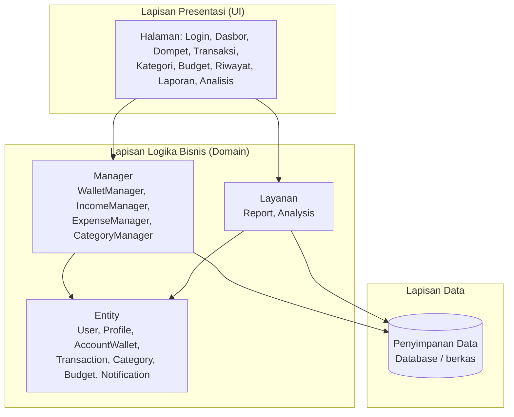
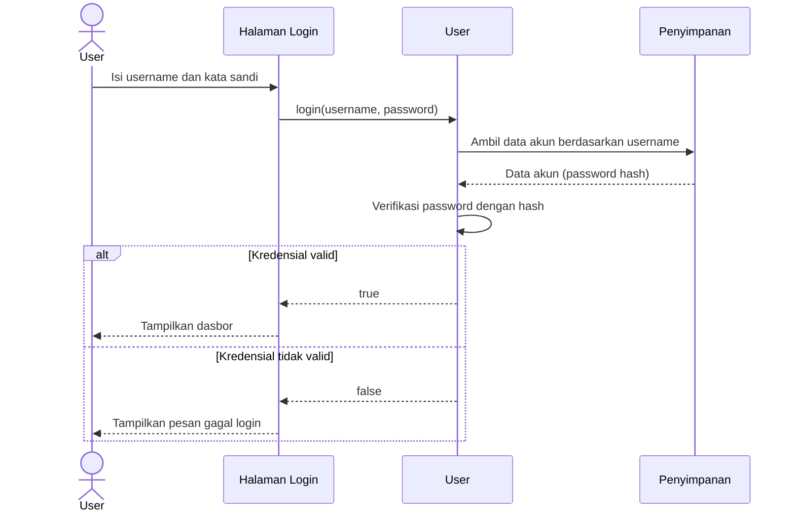
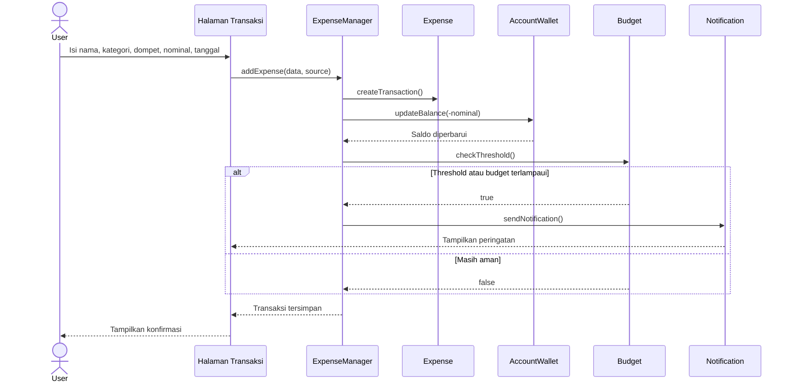
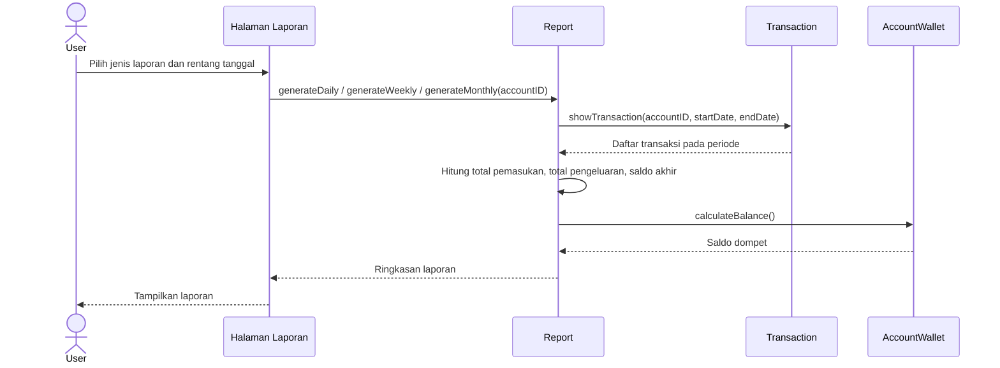
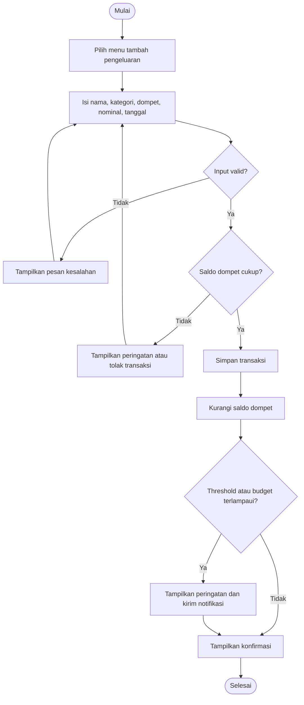
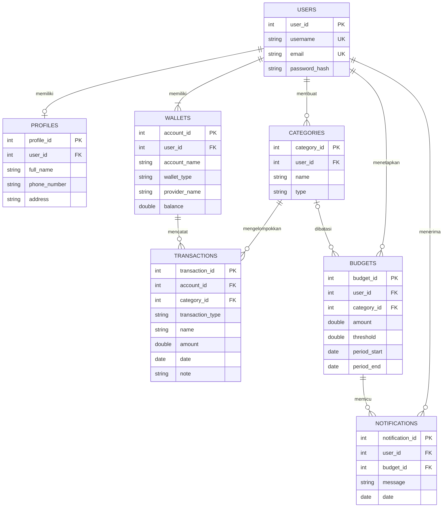
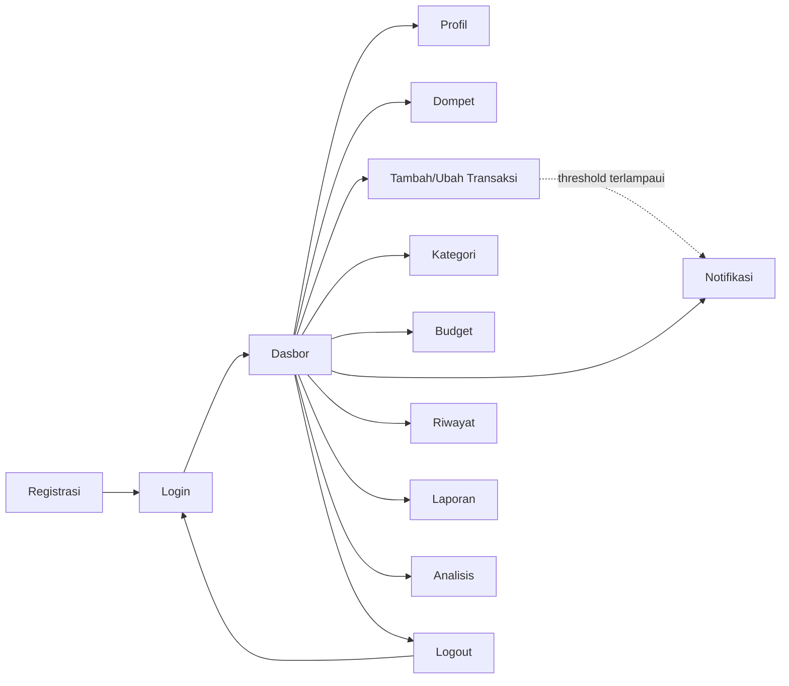

# Deskripsi Perancangan Perangkat Lunak (DPPL)

## FinTrack: Personal Finance Management System

| | |
|---|---|
| **Mata Kuliah** | Implementasi dan Pengujian Perangkat Lunak |
| **Program Studi** | Informatika, Direktorat Kampus Surabaya, Universitas Telkom |
| **Dosen Pengampu** | Daud Muhajir, S.Kom., M.Kom. |
| **Versi Dokumen** | 1.0 |
| **Tahun** | 2026 |

**Anggota Tim**

| No | Nama | NIM |
|---|---|---|
| 1 | Fathir Al Farih | 103072400002 |
| 2 | Bethari Nevyta Amaries | 103072430016 |
| 3 | A'ilah Nailul Fa'izah | 103072400042 |
| 4 | Julio Chrysanto Tanlain | 103072400110 |
| 5 | Misael Arafian Fonataba | 103072400017 |

---

## Daftar Isi

1. [Pendahuluan](#1-pendahuluan)
2. [Perancangan Arsitektur](#2-perancangan-arsitektur)
3. [Perancangan Rinci](#3-perancangan-rinci)
4. [Perancangan Data](#4-perancangan-data)
5. [Perancangan Antarmuka](#5-perancangan-antarmuka)
6. [Keterlacakan terhadap SKPL](#6-keterlacakan-terhadap-skpl)
7. [Keputusan Terbuka](#7-keputusan-terbuka)

---

## 1. Pendahuluan

### 1.1 Tujuan

Dokumen ini menjelaskan rancangan perangkat lunak **FinTrack** berdasarkan kebutuhan pada dokumen SKPL. Dokumen menjadi acuan bagi pengembang dalam implementasi dan bagi penguji dalam menyusun skenario pengujian.

### 1.2 Lingkup

Rancangan mencakup sembilan modul FinTrack: Manajemen User, Multi Dompet, Pemasukan, Pengeluaran, Kategori, Kontrol Pengeluaran Otomatis, Riwayat Transaksi, Visualisasi dan Pelaporan, serta Analisis Pengeluaran.

### 1.3 Definisi dan Singkatan

| Istilah | Definisi |
|---|---|
| DPPL / SDD | Deskripsi Perancangan Perangkat Lunak / *Software Design Description* |
| SKPL | Spesifikasi Kebutuhan Perangkat Lunak |
| OOP | *Object-Oriented Programming* |
| ERD | *Entity Relationship Diagram* |
| PK / FK / UK | *Primary Key* / *Foreign Key* / *Unique Key* |
| Manager | Class yang mengelola koleksi objek (tambah, ubah, hapus) |

### 1.4 Referensi

- Dokumen SKPL FinTrack (`SKPL.md`), termasuk class diagram pada Lampiran 7.1
- Proposal Tugas Besar FinTrack, Mata Kuliah ......................, Universitas Telkom Surabaya, 2026
- IEEE Std 1016-2009, *Systems Design: Software Design Descriptions*

---

## 2. Perancangan Arsitektur

### 2.1 Gaya Arsitektur

FinTrack memakai **arsitektur berlapis (*layered architecture*)** dengan pendekatan berorientasi objek, agar tanggung jawab tiap lapisan jelas dan mudah dikembangkan.



### 2.2 Komponen Utama

| Lapisan | Komponen | Tanggung Jawab |
|---|---|---|
| Presentasi | Halaman/form | Menerima input pengguna dan menampilkan hasil, peringatan, dan laporan |
| Logika bisnis | Entity | Menyimpan state dan aturan tiap objek (misalnya `AccountWallet.updateBalance()`) |
| Logika bisnis | Manager | Mengelola koleksi entity dan mengoordinasikan operasi lintas objek |
| Logika bisnis | Report, Analysis | Menghitung ringkasan dan statistik dari transaksi |
| Data | Penyimpanan | Menyimpan data secara persisten (SKPL-NF-010) |

### 2.3 Keputusan Rancangan

| No | Keputusan | Alasan |
|---|---|---|
| D-01 | Atribut sensitif (`password`, `balance`) dibuat `private` dan diakses lewat method | Memenuhi SKPL-NF-001 (*encapsulation*) |
| D-02 | `AccountWallet` dan `Transaction` dijadikan *abstract class* dengan turunan | Menyatukan atribut umum dan memudahkan penambahan tipe baru (SKPL-NF-009) |
| D-03 | `Transaction` mengimplementasikan interface `FinancialAction` | Menyeragamkan operasi `execute()` dan `rollback()` |
| D-04 | Pengelolaan koleksi dipisah ke class Manager | Memisahkan logika entitas dan logika pengelolaan, sesuai prinsip *single responsibility* |
| D-05 | Report dan Analysis dihitung dari data transaksi, tidak disimpan sebagai tabel | Menghindari data ganda dan inkonsistensi |
| D-06 | Kata sandi disimpan dalam bentuk *hash* | Memenuhi SKPL-NF-002 |
| D-07 | `threshold` disimpan sebagai pecahan 0 sampai 1 dari budget (misalnya 0,8 berarti 80%) | Mempermudah perbandingan dengan rasio penggunaan budget |

### 2.4 Penerapan Pilar OOP

| Pilar | Penerapan |
|---|---|
| Encapsulation | `User.password`, `User.email`, `AccountWallet.balance` bersifat private |
| Inheritance | `AccountWallet` menurunkan `PhysicalWallet` dan `EWallet`; `Transaction` menurunkan `Income` dan `Expense` |
| Abstraction | `AccountWallet` dan `Transaction` sebagai abstract class; `FinancialAction` sebagai interface |
| Polymorphism | Method perhitungan saldo/total dioverride oleh class turunan dan dipanggil lewat tipe induk |

---

## 3. Perancangan Rinci

### 3.1 Class Diagram

Class diagram lengkap per modul ada pada **SKPL Lampiran 7.1** (relasi: *association*, *aggregation*, *composition*). Berikut deskripsi tanggung jawab class-nya.

| Class | Jenis | Tanggung Jawab | Modul |
|---|---|---|---|
| `User` | Entity | Akun pengguna: register, login, logout, edit profil | 1 |
| `Profile` | Entity | Data profil (nama lengkap, telepon, alamat); komposisi dari `User` | 1 |
| `AccountWallet` | Abstract | Induk dompet: id, nama, saldo, `updateBalance()` | 2 |
| `PhysicalWallet` | Entity | Dompet tunai | 2 |
| `EWallet` | Entity | Dompet digital, memiliki `providerName` | 2 |
| `WalletManager` | Manager | Tambah, ubah, hapus dompet; hitung total saldo | 2 |
| `Transaction` | Abstract | Induk transaksi: id, nominal, kategori, tanggal, catatan | 3, 4 |
| `FinancialAction` | Interface | Kontrak `execute()` dan `rollback()` | 3, 4 |
| `Income` | Entity | Transaksi pemasukan | 3 |
| `IncomeManager` | Manager | Tambah, ubah, hapus pemasukan | 3 |
| `Expense` | Entity | Transaksi pengeluaran | 4 |
| `ExpenseManager` | Manager | Tambah, ubah, hapus pengeluaran | 4 |
| `Category` | Entity | Kategori bertipe pemasukan atau pengeluaran | 5 |
| `CategoryManager` | Manager | Tambah, ubah, hapus, dan filter kategori | 5 |
| `Budget` | Entity | Batas anggaran dan threshold; `checkThreshold()` | 6 |
| `Notification` | Entity | Pesan peringatan budget; `sendNotification()` | 6 |
| `Report` | Layanan | Laporan harian, mingguan, bulanan | 8 |
| `Analysis` | Layanan | Kategori terboros, rata-rata, persentase kategori | 9 |

### 3.2 Sequence Diagram

#### 3.2.1 Login (UC-02)



#### 3.2.2 Catat Pengeluaran dan Peringatan Budget (UC-06, UC-09)



#### 3.2.3 Lihat Laporan (UC-11)



### 3.3 Activity Diagram: Catat Pengeluaran



### 3.4 Perancangan Algoritma

**a. Pembaruan saldo** (`AccountWallet.updateBalance(amount)`)

```text
balance <- balance + amount
  - amount bernilai positif untuk pemasukan
  - amount bernilai negatif untuk pengeluaran
```

Saat transaksi diedit, saldo dikoreksi dengan selisih nilai lama dan baru. Saat transaksi dihapus, saldo dikembalikan (`rollback()`).

**b. Pemeriksaan threshold** (`Budget.checkThreshold()`)

```text
spent <- total pengeluaran pada periode budget (per kategori atau keseluruhan)
ratio <- spent / budget
jika ratio >= 1          -> status MELEBIHI  (peringatan, return true)
jika ratio >= threshold  -> status MENDEKATI (peringatan, return true)
selain itu               -> status AMAN      (return false)
```

**c. Persentase kategori** (`Analysis.categoryPercentage()`)

```text
untuk setiap kategori k:
    persen(k) <- total pengeluaran kategori k / total pengeluaran periode x 100
```

**d. Kategori terboros dan rata-rata** (`largestCategory()`, `averageExpend()`)

```text
largestCategory <- kategori dengan total pengeluaran terbesar pada periode
averageExpend   <- total pengeluaran periode / jumlah transaksi pengeluaran
```

**e. Net cash flow dan saldo akhir**

```text
netCashFlow <- total pemasukan periode - total pengeluaran periode
```

---

## 4. Perancangan Data

### 4.1 Entity Relationship Diagram



### 4.2 Pemetaan Class ke Tabel

| Class | Tabel | Catatan |
|---|---|---|
| `User` | `USERS` | `password` disimpan sebagai `password_hash` |
| `Profile` | `PROFILES` | Satu profil per pengguna |
| `AccountWallet`, `PhysicalWallet`, `EWallet` | `WALLETS` | Pewarisan dipetakan dengan kolom `wallet_type` (`PHYSICAL` atau `EWALLET`); `provider_name` terisi untuk e-wallet |
| `Transaction`, `Income`, `Expense` | `TRANSACTIONS` | Pewarisan dipetakan dengan kolom `transaction_type` (`INCOME` atau `EXPENSE`) |
| `Category` | `CATEGORIES` | `type` bernilai pemasukan atau pengeluaran |
| `Budget` | `BUDGETS` | `category_id` kosong (NULL) berarti budget total |
| `Notification` | `NOTIFICATIONS` | Terkait budget yang terlampaui |
| `Report`, `Analysis` | (tidak ada tabel) | Dihitung dari `TRANSACTIONS` (keputusan D-05) |

### 4.3 Aturan Integritas

- Menghapus dompet atau kategori yang masih dipakai transaksi harus ditolak atau disertai konfirmasi (tentukan perilaku final).
- Nominal transaksi harus lebih dari nol.
- `threshold` bernilai antara 0 dan 1.
- `username` dan `email` bersifat unik.

---

## 5. Perancangan Antarmuka

### 5.1 Daftar Halaman

| No | Halaman | Fungsi | Use Case |
|---|---|---|---|
| 1 | Registrasi | Membuat akun baru | UC-01 |
| 2 | Login | Masuk ke sistem | UC-02 |
| 3 | Dasbor | Total saldo, ringkasan transaksi terbaru, status budget | UC-04, UC-11 |
| 4 | Profil | Lihat dan ubah profil | UC-03 |
| 5 | Dompet | Daftar dompet, tambah, ubah, hapus, sembunyikan saldo | UC-04 |
| 6 | Tambah/Ubah Transaksi | Form pemasukan dan pengeluaran | UC-05, UC-06 |
| 7 | Kategori | Kelola kategori pemasukan dan pengeluaran | UC-07 |
| 8 | Budget | Atur budget total, budget kategori, dan threshold | UC-08 |
| 9 | Notifikasi | Daftar peringatan budget | UC-09 |
| 10 | Riwayat Transaksi | Daftar transaksi dengan filter | UC-10 |
| 11 | Laporan | Laporan harian, mingguan, bulanan | UC-11 |
| 12 | Analisis | Kategori terboros, rata-rata, persentase kategori | UC-12 |

### 5.2 Alur Navigasi



### 5.3 Rancangan Layar Utama

*Tambahkan gambar mockup (misalnya dari Figma) ke `docs/img/` lalu tautkan di sini.* Elemen minimal tiap layar:

| Layar | Elemen Utama |
|---|---|
| Dasbor | Total saldo (dengan tombol sembunyikan/tampilkan), daftar dompet, 5 transaksi terakhir, indikator budget |
| Form transaksi | Nama, kategori (dropdown), dompet (dropdown), nominal, tanggal, catatan, tombol simpan |
| Riwayat | Filter tanggal, kategori, dompet, jenis; daftar transaksi; ringkasan net cash flow |
| Laporan | Pilihan periode, total pemasukan, total pengeluaran, saldo akhir, grafik persentase pengeluaran |

### 5.4 Pesan Sistem

| Kondisi | Pesan |
|---|---|
| Login gagal | "Username atau kata sandi salah." |
| Registrasi dengan data yang sudah ada | "Email atau username sudah terdaftar." |
| Mendekati threshold | "Pengeluaran kategori [nama] sudah mencapai [x]% dari budget." |
| Melebihi budget | "Budget kategori [nama] telah terlampaui." |
| Saldo tidak cukup | "Saldo dompet tidak mencukupi." |

---

## 6. Keterlacakan terhadap SKPL

| Modul | Kebutuhan SKPL | Class | Diagram Rancangan | Halaman |
|---|---|---|---|---|
| 1. Manajemen User | F-001 sampai F-006 | User, Profile | 3.2.1 | 1, 2, 4 |
| 2. Multi Dompet | F-007 sampai F-012 | AccountWallet, PhysicalWallet, EWallet, WalletManager | 3.1 | 3, 5 |
| 3. Pemasukan | F-013 sampai F-015 | Transaction, Income, IncomeManager | 3.1 | 6 |
| 4. Pengeluaran | F-016 sampai F-019 | Transaction, Expense, ExpenseManager | 3.2.2, 3.3 | 6 |
| 5. Kategori | F-020 sampai F-023 | Category, CategoryManager | 3.1 | 7 |
| 6. Kontrol Pengeluaran | F-024 sampai F-028 | Budget, Notification | 3.2.2, 3.4b | 8, 9 |
| 7. Riwayat | F-029 sampai F-034 | Transaction, AccountWallet, Category | 3.4e | 10 |
| 8. Pelaporan | F-035 sampai F-041 | Report | 3.2.3, 3.4e | 11 |
| 9. Analisis | F-042 sampai F-044 | Analysis | 3.4c, 3.4d | 12 |

Kebutuhan nonfungsional: NF-001 sampai NF-004 dipenuhi oleh D-01 dan D-06; NF-008 dan NF-009 oleh D-02 dan D-04; NF-010 oleh lapisan data (bagian 4).

---

## 7. Keputusan Terbuka

1. **Teknologi:** bahasa pemrograman, platform (desktop/web/mobile), dan jenis penyimpanan (database atau berkas) belum ditetapkan. Lengkapi bagian 2 dan 4 setelah diputuskan.
2. **Kepemilikan kategori:** pada class diagram, `CategoryManager` tidak terhubung ke `User`. Rancangan ini menambahkan `user_id` pada `CATEGORIES` agar tiap pengguna memiliki kategori sendiri. Konfirmasi keputusan ini.
3. **Budget per kategori:** class `Budget` memuat `totalBudget` dan `categoryBudget` sekaligus. Pada tabel, keduanya dipisah menjadi baris-baris berbeda (`category_id` NULL untuk budget total). Sesuaikan class diagram jika ingin konsisten.
4. **Perilaku saldo tidak cukup** (SKPL-F-019): tolak transaksi atau beri konfirmasi.
5. **Penghapusan dompet atau kategori yang sudah dipakai** (bagian 4.3): tolak, atau pindahkan transaksinya.
6. **Transfer antar dompet:** belum dirancang karena belum ada di class diagram. Jika ditambahkan di SKPL, tambahkan class dan sequence diagram-nya di sini.

---

## Riwayat Revisi

| Versi | Tanggal | Perubahan | Penulis |
|---|---|---|---|
| 1.0 | 2026 | Draf awal berdasarkan SKPL dan class diagram | Tim FinTrack |
