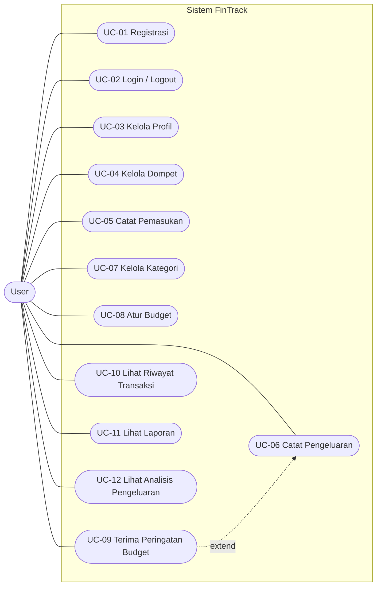
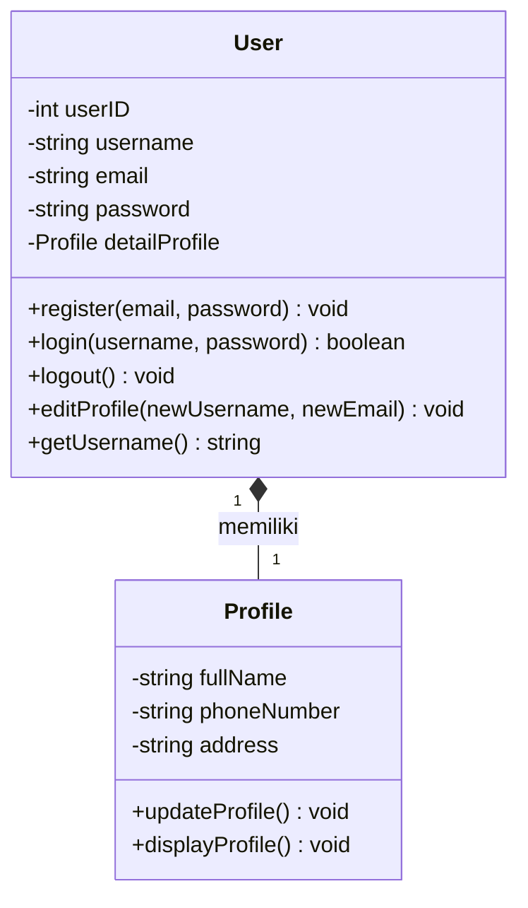
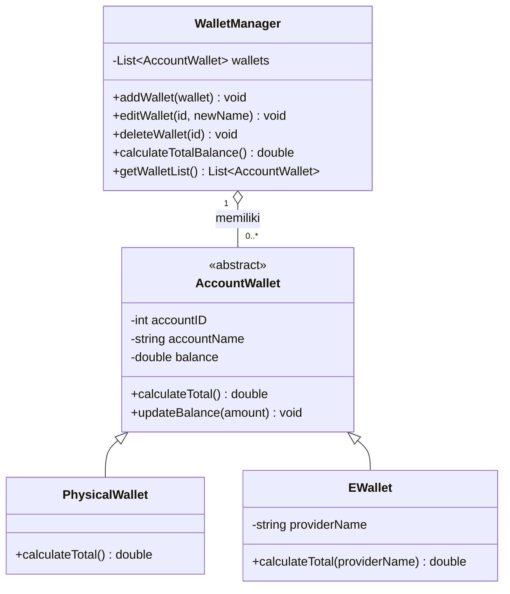
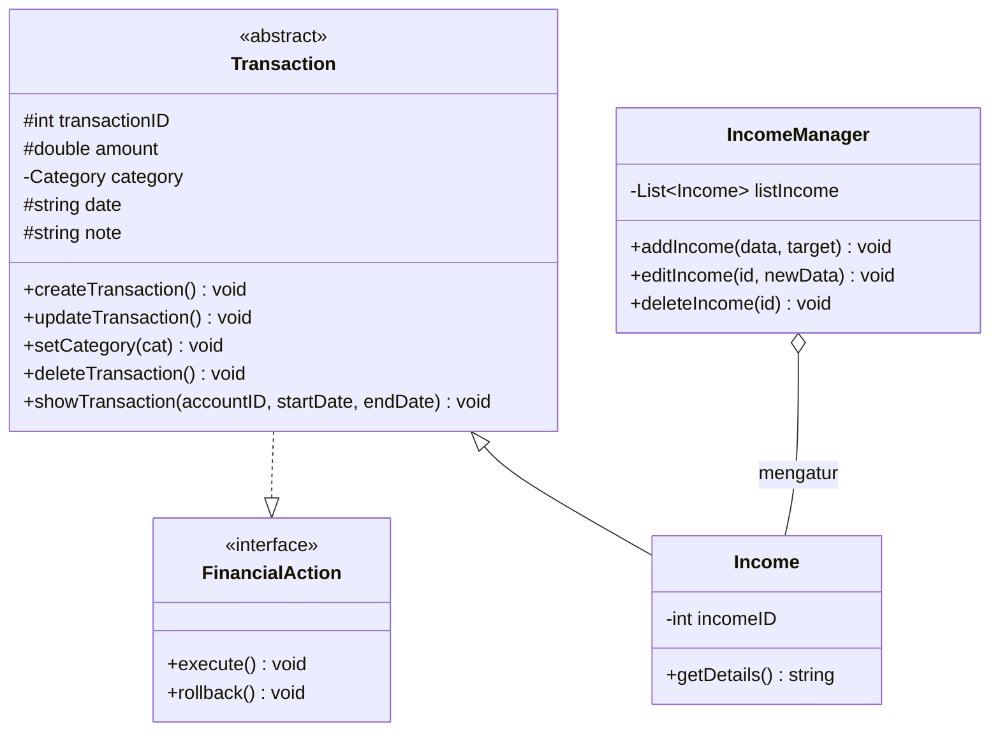
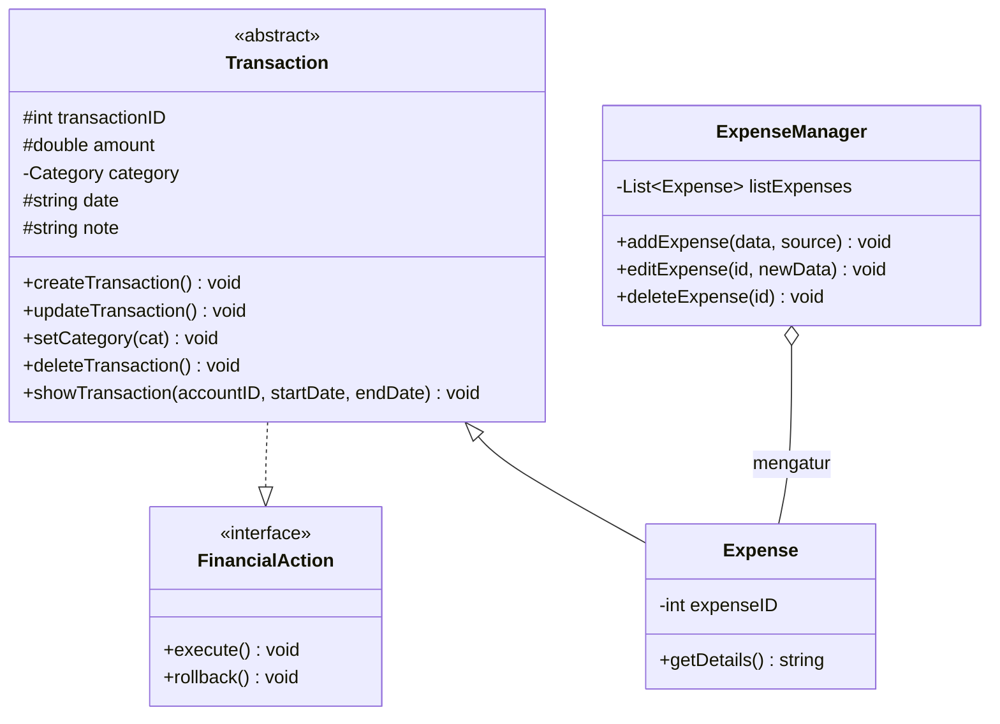
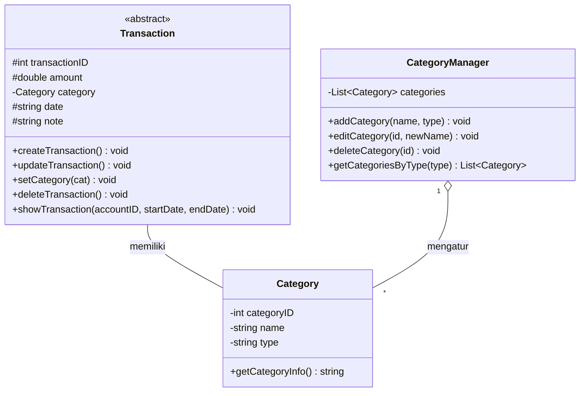
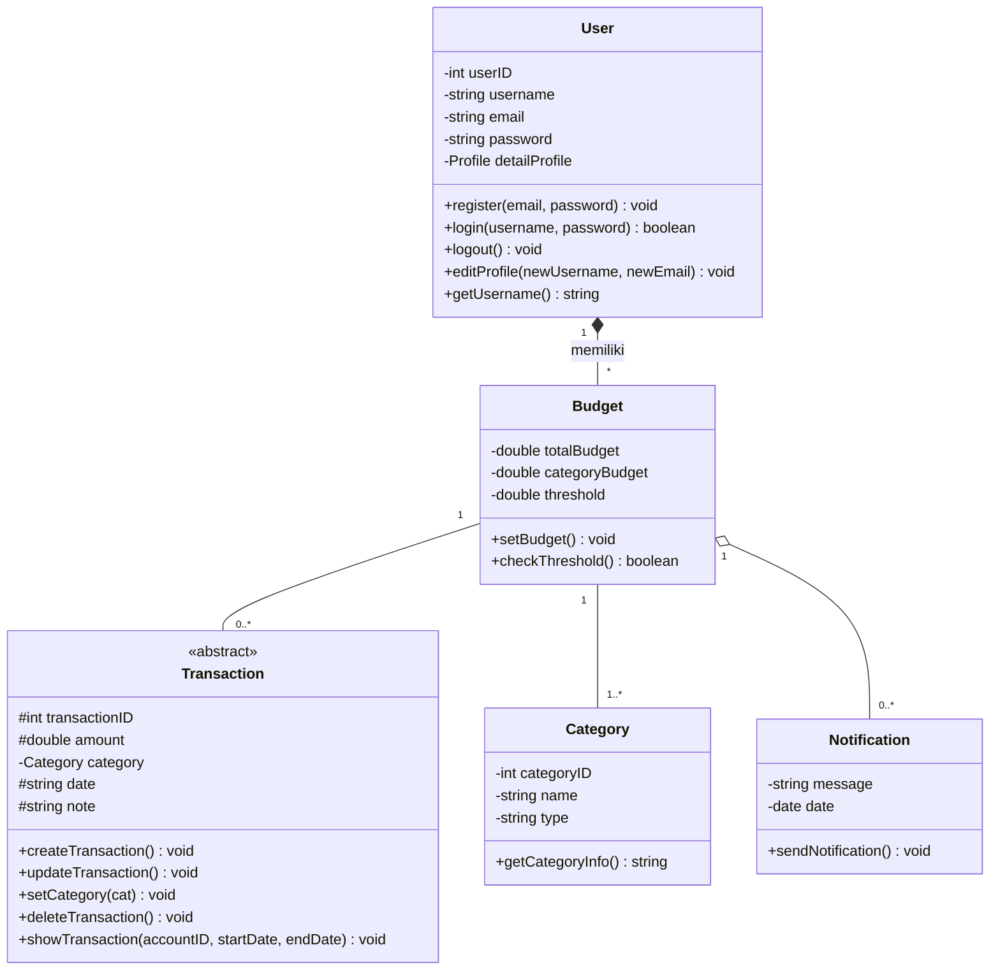
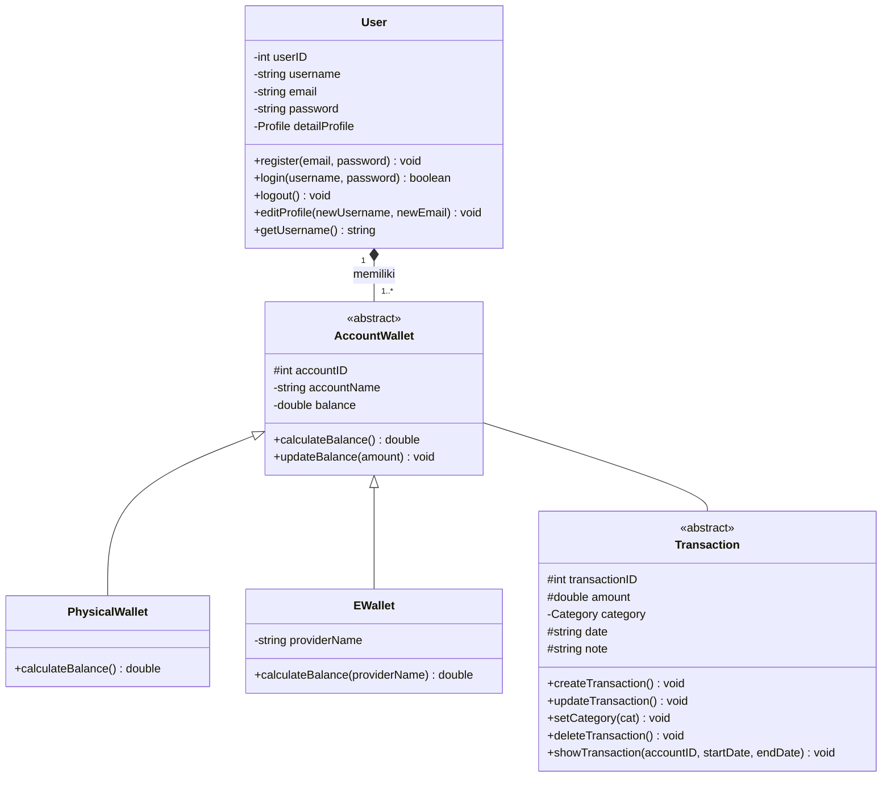
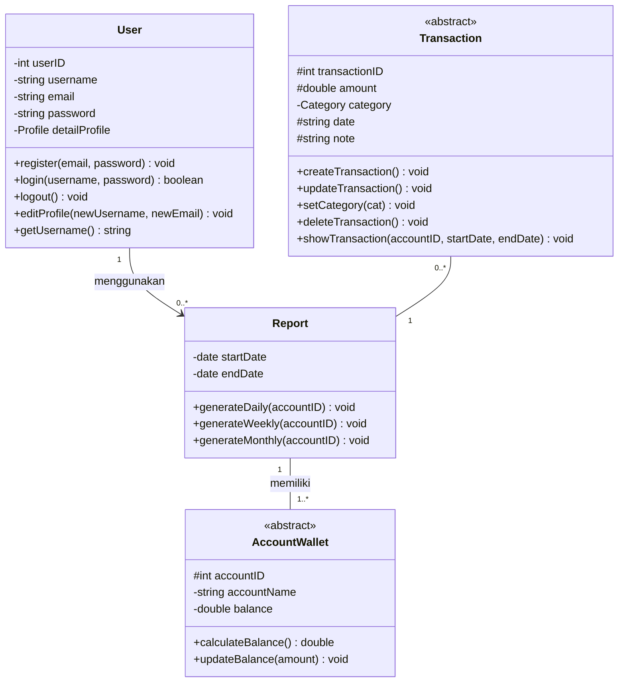
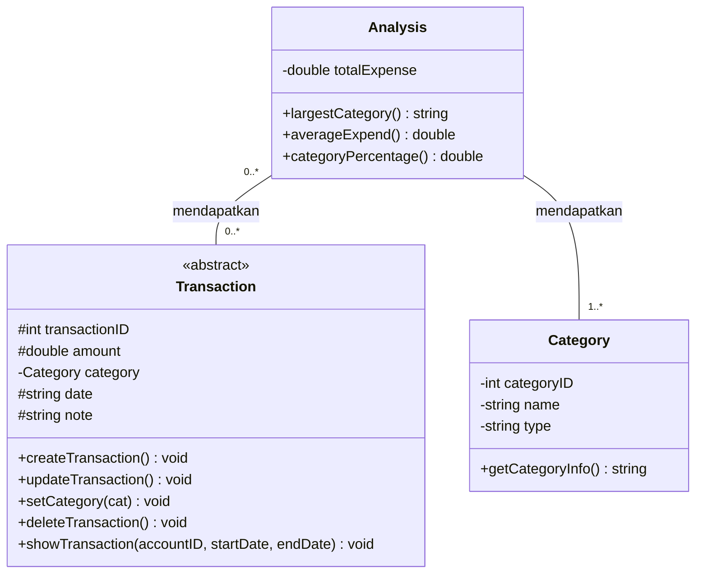

# Spesifikasi Kebutuhan Perangkat Lunak (SKPL)

## FinTrack: Personal Finance Management System

| | |
|---|---|---|
| **Mata Kuliah** | Implementasi dan Pengujian Perangkat Lunak |
| **Program Studi** | Informatika, Direktorat Kampus Surabaya, Universitas Telkom |
| **Dosen Pengampu** | Daud Muhajir, S.Kom., M.Kom. |
| **Versi Dokumen** | 1.0 |
| **Tahun** | 2026 |

**Anggota Tim**

| No | Nama | NIM |
|---|---|---|
| 1 | Fathir Al Farih | 103072400002 |
| 2 | Bethari Nevyta Amaries | 103072430016 |
| 3 | A'ilah Nailul Fa'izah | 103072400042 |
| 4 | Julio Chrysanto Tanlain | 103072400110 |
| 5 | Misael Arafian Fonataba | 103072400017 |

---

## Daftar Isi

1. [Pendahuluan](#1-pendahuluan)
2. [Deskripsi Umum](#2-deskripsi-umum)
3. [Kebutuhan Fungsional](#3-kebutuhan-fungsional)
4. [Kebutuhan Antarmuka Eksternal](#4-kebutuhan-antarmuka-eksternal)
5. [Kebutuhan Nonfungsional](#5-kebutuhan-nonfungsional)
6. [Kebutuhan Data](#6-kebutuhan-data)
7. [Lampiran](#7-lampiran)

---

## 1. Pendahuluan

### 1.1 Tujuan Penulisan

Dokumen ini mendefinisikan kebutuhan fungsional dan nonfungsional perangkat lunak **FinTrack**. Dokumen ditujukan bagi pengembang, penguji, dan dosen pengampu sebagai acuan dalam perancangan, implementasi, dan pengujian sistem.

### 1.2 Lingkup Produk

FinTrack adalah aplikasi manajemen keuangan pribadi berbasis *Object-Oriented Programming* (OOP) yang membantu mahasiswa, terutama mahasiswa rantau, mengelola keuangan dalam satu platform terintegrasi.

**Yang tercakup:**

- Manajemen akun pengguna dan profil
- Manajemen banyak dompet (tunai, bank digital, e-wallet) dengan total saldo gabungan
- Pencatatan pemasukan dan pengeluaran
- Pengelolaan kategori transaksi
- Kontrol pengeluaran otomatis (anggaran, threshold, notifikasi)
- Riwayat transaksi dengan filter
- Visualisasi dan pelaporan (harian, mingguan, bulanan)
- Analisis pengeluaran

**Yang tidak tercakup (batasan lingkup versi 1.0):**

- Integrasi langsung dengan bank atau e-wallet (saldo dan transaksi diinput manual)
- Fitur investasi, pinjaman, atau pembayaran
- Fitur berbagi data antarpengguna

### 1.3 Definisi, Akronim, dan Singkatan

| Istilah | Definisi |
|---|---|
| SKPL | Spesifikasi Kebutuhan Perangkat Lunak |
| OOP | *Object-Oriented Programming* |
| Dompet | Sumber dana pengguna, misalnya uang tunai, rekening bank, atau e-wallet |
| E-Wallet | Dompet digital yang memiliki penyedia (*provider*) tertentu |
| Transaksi | Catatan pemasukan atau pengeluaran |
| Kategori | Pengelompokan transaksi, bertipe pemasukan atau pengeluaran |
| Budget | Batas anggaran pengeluaran dalam satu periode |
| Threshold | Ambang batas persentase penggunaan budget yang memicu peringatan |
| Net cash flow | Selisih total pemasukan dan total pengeluaran dalam suatu periode |
| Aktor | Pihak yang berinteraksi dengan sistem |

### 1.4 Referensi

- Proposal Tugas Besar FinTrack, Mata Kuliah ......................, Universitas Telkom Surabaya, 2026
- IEEE Std 830-1998, *Recommended Practice for Software Requirements Specifications*

### 1.5 Gambaran Umum Dokumen

Bagian 2 menjelaskan gambaran umum produk. Bagian 3 memuat kebutuhan fungsional per modul. Bagian 4 sampai 6 memuat kebutuhan antarmuka, nonfungsional, dan data. Bagian 7 berisi lampiran pendukung.

---

## 2. Deskripsi Umum

### 2.1 Perspektif Produk

FinTrack adalah aplikasi mandiri yang menyatukan pencatatan transaksi, manajemen multi dompet, dan penganggaran dalam satu ekosistem. Sistem dibangun dengan prinsip OOP: *encapsulation* untuk melindungi data sensitif (saldo dan kredensial), *inheritance* untuk tipe dompet dan transaksi, *abstraction* melalui abstract class dan interface, serta *polymorphism* melalui *method overriding*.

### 2.2 Fungsi Produk

Sistem terdiri atas sembilan modul:

| No | Modul | Ringkasan |
|---|---|---|
| 1 | Manajemen User | Registrasi, login, logout, edit profil |
| 2 | Manajemen Multi Dompet | Tambah, edit, hapus dompet; saldo per dompet dan total |
| 3 | Pencatatan Pemasukan | Tambah, edit, hapus pemasukan |
| 4 | Pencatatan Pengeluaran | Tambah, edit, hapus pengeluaran |
| 5 | Kategori Transaksi | Tambah, edit, hapus kategori |
| 6 | Kontrol Pengeluaran Otomatis | Budget total/kategori, threshold, notifikasi |
| 7 | Riwayat Transaksi | Filter tanggal, kategori, dompet, jenis; net cash flow |
| 8 | Visualisasi dan Pelaporan | Laporan harian, mingguan, bulanan dan ringkasan |
| 9 | Analisis Pengeluaran | Kategori terboros, rata-rata, persentase kategori |

### 2.3 Karakteristik Pengguna

| Aktor | Deskripsi | Hak Akses |
|---|---|---|
| User | Mahasiswa pengguna aplikasi, terutama mahasiswa rantau, dengan literasi teknologi dasar | Seluruh fitur pada data miliknya sendiri setelah login |

Pengguna yang belum login hanya dapat mengakses registrasi dan login.

### 2.4 Batasan

- Sistem dikembangkan dengan pendekatan OOP.
- Data keuangan bersifat pribadi sehingga atribut sensitif (`password`, `balance`) harus bersifat *private*.
- Seluruh data transaksi dan saldo diinput secara manual oleh pengguna.

### 2.5 Asumsi dan Ketergantungan

- Pengguna memiliki perangkat yang dapat menjalankan aplikasi.
- Mata uang yang digunakan adalah Rupiah (IDR).
- Teknologi implementasi (bahasa, platform, dan penyimpanan data) ditetapkan pada tahap perancangan. *(Isi bagian ini setelah keputusan teknologi final.)*

---

## 3. Kebutuhan Fungsional

Prioritas: **T** = Tinggi, **S** = Sedang, **R** = Rendah.

### 3.1 Modul 1: Manajemen User

| ID | Kebutuhan | Prioritas |
|---|---|---|
| SKPL-F-001 | Sistem harus memungkinkan pengguna mendaftar akun baru dengan mengisi email, username, dan kata sandi. | T |
| SKPL-F-002 | Sistem harus memvalidasi bahwa email dan username yang didaftarkan belum digunakan. | T |
| SKPL-F-003 | Sistem harus memungkinkan pengguna login menggunakan username dan kata sandi yang terdaftar, dan menolak akses jika tidak sesuai. | T |
| SKPL-F-004 | Sistem harus memungkinkan pengguna logout dan mengakhiri sesi. | T |
| SKPL-F-005 | Sistem harus memungkinkan pengguna mengubah username dan email. | S |
| SKPL-F-006 | Sistem harus memungkinkan pengguna mengubah informasi profil: nama lengkap, nomor telepon, dan alamat. | S |

### 3.2 Modul 2: Manajemen Multi Dompet

| ID | Kebutuhan | Prioritas |
|---|---|---|
| SKPL-F-007 | Sistem harus memungkinkan pengguna menambah dompet dengan nama, jenis (tunai atau e-wallet/bank digital), dan saldo awal. Untuk e-wallet, pengguna mengisi nama penyedia (*provider*). | T |
| SKPL-F-008 | Sistem harus memungkinkan pengguna mengedit nama, jenis, dan sumber dana dompet. | S |
| SKPL-F-009 | Sistem harus memungkinkan pengguna menghapus dompet. | S |
| SKPL-F-010 | Sistem harus menampilkan saldo setiap dompet. Nominal saldo harus dapat disembunyikan dan ditampilkan kembali oleh pengguna. | T |
| SKPL-F-011 | Sistem harus menampilkan total saldo keseluruhan dari seluruh dompet milik pengguna. | T |
| SKPL-F-012 | Sistem harus memperbarui saldo dompet secara otomatis ketika transaksi ditambah, diubah, atau dihapus. | T |

### 3.3 Modul 3: Pencatatan Pemasukan

| ID | Kebutuhan | Prioritas |
|---|---|---|
| SKPL-F-013 | Sistem harus memungkinkan pengguna menambah pemasukan dengan nominal, tanggal, kategori, catatan, dan dompet tujuan. | T |
| SKPL-F-014 | Sistem harus memungkinkan pengguna mengedit nominal, kategori, dompet, tanggal, dan catatan pemasukan yang sudah tercatat. | T |
| SKPL-F-015 | Sistem harus memungkinkan pengguna menghapus pemasukan. | T |

### 3.4 Modul 4: Pencatatan Pengeluaran

| ID | Kebutuhan | Prioritas |
|---|---|---|
| SKPL-F-016 | Sistem harus memungkinkan pengguna menambah pengeluaran dengan nama transaksi, kategori, dompet sumber, nominal, dan tanggal. | T |
| SKPL-F-017 | Sistem harus memungkinkan pengguna mengedit nama, kategori, dompet sumber, nominal, dan tanggal pengeluaran. | T |
| SKPL-F-018 | Sistem harus memungkinkan pengguna menghapus pengeluaran. | T |
| SKPL-F-019 | Sistem harus menolak pengeluaran yang nominalnya melebihi saldo dompet sumber, atau memberi konfirmasi kepada pengguna sebelum melanjutkan. *(Tentukan perilaku final di tim.)* | S |

### 3.5 Modul 5: Kategori Transaksi

Kategori pemasukan dan pengeluaran dikelola di modul ini.

| ID | Kebutuhan | Prioritas |
|---|---|---|
| SKPL-F-020 | Sistem harus memungkinkan pengguna menambah kategori dengan nama dan jenis (pemasukan atau pengeluaran). | T |
| SKPL-F-021 | Sistem harus memungkinkan pengguna mengubah nama dan jenis kategori. | S |
| SKPL-F-022 | Sistem harus memungkinkan pengguna menghapus kategori yang tidak digunakan. | S |
| SKPL-F-023 | Sistem harus menampilkan daftar kategori yang dapat difilter berdasarkan jenis. | S |

### 3.6 Modul 6: Kontrol Pengeluaran Otomatis

| ID | Kebutuhan | Prioritas |
|---|---|---|
| SKPL-F-024 | Sistem harus memungkinkan pengguna menetapkan budget total untuk satu periode. | T |
| SKPL-F-025 | Sistem harus memungkinkan pengguna menetapkan budget untuk setiap kategori pengeluaran. | T |
| SKPL-F-026 | Sistem harus memungkinkan pengguna menetapkan nilai threshold peringatan. | T |
| SKPL-F-027 | Sistem harus memeriksa budget setiap kali pengeluaran dicatat dan menampilkan peringatan jika pengeluaran mendekati atau melampaui threshold atau budget. | T |
| SKPL-F-028 | Sistem harus mengirim notifikasi otomatis kepada pengguna ketika kondisi peringatan budget terpenuhi. | T |

### 3.7 Modul 7: Riwayat Transaksi

| ID | Kebutuhan | Prioritas |
|---|---|---|
| SKPL-F-029 | Sistem harus menampilkan riwayat seluruh transaksi milik pengguna. | T |
| SKPL-F-030 | Sistem harus menyediakan filter berdasarkan rentang tanggal. | T |
| SKPL-F-031 | Sistem harus menyediakan filter berdasarkan kategori. | T |
| SKPL-F-032 | Sistem harus menyediakan filter berdasarkan dompet. | T |
| SKPL-F-033 | Sistem harus menyediakan filter berdasarkan jenis transaksi (pemasukan atau pengeluaran). | T |
| SKPL-F-034 | Sistem harus menghitung dan menampilkan net cash flow untuk periode yang difilter. | S |

> **Catatan:** Proposal menyebut "transfer antar dompet" sebagai jenis transaksi, tetapi belum ada fiturnya di modul mana pun. Jika ingin disertakan, tambahkan sebagai kebutuhan baru di Modul 2 (lihat bagian Pertanyaan Terbuka).

### 3.8 Modul 8: Visualisasi dan Pelaporan

| ID | Kebutuhan | Prioritas |
|---|---|---|
| SKPL-F-035 | Sistem harus menghasilkan laporan harian berisi ringkasan pemasukan dan pengeluaran. | T |
| SKPL-F-036 | Sistem harus menghasilkan laporan mingguan untuk rentang tanggal yang dipilih. | T |
| SKPL-F-037 | Sistem harus menghasilkan laporan bulanan untuk rentang tanggal yang dipilih. | T |
| SKPL-F-038 | Sistem harus menampilkan total pemasukan pada periode laporan. | T |
| SKPL-F-039 | Sistem harus menampilkan total pengeluaran pada periode laporan. | T |
| SKPL-F-040 | Sistem harus menampilkan saldo akhir periode (total pemasukan dikurangi total pengeluaran). | T |
| SKPL-F-041 | Sistem harus menyajikan ringkasan persentase pengeluaran per periode untuk membantu pengguna mengevaluasi perilaku keuangannya. | S |

### 3.9 Modul 9: Analisis Pengeluaran

| ID | Kebutuhan | Prioritas |
|---|---|---|
| SKPL-F-042 | Sistem harus menampilkan kategori dengan total pengeluaran terbesar pada periode tertentu. | S |
| SKPL-F-043 | Sistem harus menghitung rata-rata nominal transaksi pengeluaran pada periode tertentu. | S |
| SKPL-F-044 | Sistem harus menghitung persentase pengeluaran tiap kategori terhadap total pengeluaran. | S |

### 3.10 Use Case

| ID | Use Case | Aktor | Kebutuhan Terkait |
|---|---|---|---|
| UC-01 | Registrasi | User | F-001, F-002 |
| UC-02 | Login / Logout | User | F-003, F-004 |
| UC-03 | Kelola Profil | User | F-005, F-006 |
| UC-04 | Kelola Dompet | User | F-007 sampai F-012 |
| UC-05 | Catat Pemasukan | User | F-013 sampai F-015 |
| UC-06 | Catat Pengeluaran | User | F-016 sampai F-019 |
| UC-07 | Kelola Kategori | User | F-020 sampai F-023 |
| UC-08 | Atur Budget | User | F-024 sampai F-026 |
| UC-09 | Terima Peringatan Budget | User | F-027, F-028 |
| UC-10 | Lihat Riwayat Transaksi | User | F-029 sampai F-034 |
| UC-11 | Lihat Laporan | User | F-035 sampai F-041 |
| UC-12 | Lihat Analisis Pengeluaran | User | F-042 sampai F-044 |

**Skenario contoh: UC-06 Catat Pengeluaran**

| | |
|---|---|
| **Prasyarat** | Pengguna sudah login; minimal satu dompet dan satu kategori pengeluaran tersedia |
| **Alur utama** | 1. Pengguna memilih menu tambah pengeluaran. 2. Pengguna mengisi nama, kategori, dompet, nominal, dan tanggal. 3. Pengguna menyimpan. 4. Sistem memvalidasi input. 5. Sistem menyimpan transaksi dan mengurangi saldo dompet. 6. Sistem memeriksa budget dan threshold. |
| **Alur alternatif** | 4a. Input tidak valid, sistem menampilkan pesan kesalahan. 6a. Threshold terlampaui, sistem menampilkan peringatan dan mengirim notifikasi. |
| **Pascakondisi** | Transaksi tersimpan, saldo dompet diperbarui |

> Tambahkan diagram use case (misalnya dari draw.io) ke `docs/img/` lalu tautkan di Lampiran.

---

## 4. Kebutuhan Antarmuka Eksternal

| ID | Kebutuhan |
|---|---|
| SKPL-I-001 | Antarmuka pengguna harus menyediakan halaman registrasi, login, dasbor, dompet, transaksi, kategori, budget, riwayat, laporan, dan analisis. |
| SKPL-I-002 | Antarmuka harus menampilkan peringatan budget secara jelas dan mudah terlihat. |
| SKPL-I-003 | Laporan dan analisis sebaiknya ditampilkan dalam bentuk visual (grafik atau tabel ringkasan). |
| SKPL-I-004 | Antarmuka perangkat keras, perangkat lunak lain, dan komunikasi: *(isi sesuai teknologi yang dipilih; v1.0 tidak memerlukan integrasi eksternal).* |

---

## 5. Kebutuhan Nonfungsional

| ID | Kategori | Kebutuhan |
|---|---|---|
| SKPL-NF-001 | Keamanan | Atribut sensitif (`password`, `email`, `balance`) harus bersifat *private* dan hanya diakses melalui method yang ditentukan (*encapsulation*). |
| SKPL-NF-002 | Keamanan | Kata sandi tidak boleh disimpan dalam bentuk teks biasa; gunakan *hashing*. |
| SKPL-NF-003 | Keamanan | Setiap pengguna hanya dapat mengakses data miliknya sendiri. |
| SKPL-NF-004 | Keamanan | Saldo harus dapat disembunyikan untuk menjaga kerahasiaan, termasuk saat perangkat dipakai bersama. |
| SKPL-NF-005 | Keandalan | Saldo dompet harus selalu konsisten dengan transaksi yang tercatat. |
| SKPL-NF-006 | Kinerja | Operasi umum (tambah transaksi, tampil riwayat) harus selesai dalam waktu wajar (target: kurang dari 2 detik). |
| SKPL-NF-007 | Kegunaan | Antarmuka harus mudah dipelajari oleh pengguna awam tanpa pelatihan khusus. |
| SKPL-NF-008 | Pemeliharaan | Kode harus modular per modul dan menerapkan empat pilar OOP agar mudah dikembangkan. |
| SKPL-NF-009 | Pemeliharaan | Penambahan tipe dompet atau transaksi baru harus dapat dilakukan melalui *inheritance* tanpa mengubah kelas induk. |
| SKPL-NF-010 | Ketersediaan data | Data pengguna harus tetap tersimpan setelah aplikasi ditutup (persisten). |

---

## 6. Kebutuhan Data

Entitas utama berdasarkan class diagram:

| Entitas | Atribut Utama | Keterangan |
|---|---|---|
| User | userID, username, email, password, detailProfile | Memiliki satu Profile (komposisi), banyak dompet dan budget |
| Profile | fullName, phoneNumber, address | Detail profil pengguna |
| AccountWallet *(abstract)* | accountID, accountName, balance | Induk dompet |
| PhysicalWallet | (turunan AccountWallet) | Dompet tunai |
| EWallet | providerName | Dompet digital |
| Transaction *(abstract)* | transactionID, amount, category, date, note | Induk transaksi; mengimplementasikan `FinancialAction` |
| Income | incomeID | Pemasukan |
| Expense | expenseID | Pengeluaran |
| Category | categoryID, name, type | Jenis: pemasukan atau pengeluaran |
| Budget | totalBudget, categoryBudget, threshold | Terkait kategori, transaksi, dan notifikasi |
| Notification | message, date | Peringatan budget |
| Report | startDate, endDate | Laporan harian, mingguan, bulanan |
| Analysis | totalExpense | Kategori terbesar, rata-rata, persentase |
| IncomeManager / ExpenseManager / WalletManager / CategoryManager | list koleksi | Kelas pengelola (agregasi) |

---

## 7. Lampiran

### 7.1 Class Diagram UML

Diagram disusun per modul mengikuti Bab II proposal (relasi: *association*, *aggregation*, dan *composition*) dan ditulis dengan [Mermaid](https://mermaid.js.org/), sehingga dirender otomatis oleh GitHub. Untuk preview di VS Code, pasang ekstensi *Markdown Preview Mermaid Support*.

#### 7.1.1 Modul 1 Manajemen User

#### 7.1.2 Modul 2 Manajemen Multi Dompet

#### 7.1.3 Modul 3 Pencatatan Pemasukan

#### 7.1.4 Modul 4 Pencatatan Pengeluaran

#### 7.1.5 Modul 5 Kategori Transaksi

#### 7.1.6 Modul 6 Kontrol Pengeluaran Otomatis

#### 7.1.7 Modul 7 Riwayat Transaksi

#### 7.1.8 Modul 8 Visualisasi dan Pelaporan

#### 7.1.9 Modul 9 Analisis Pengeluaran

### 7.2 Matriks Keterlacakan

| Modul | ID Kebutuhan | Class Terkait |
|---|---|---|
| 1. Manajemen User | F-001 sampai F-006 | User, Profile |
| 2. Multi Dompet | F-007 sampai F-012 | AccountWallet, PhysicalWallet, EWallet, WalletManager |
| 3. Pemasukan | F-013 sampai F-015 | Transaction, Income, IncomeManager |
| 4. Pengeluaran | F-016 sampai F-019 | Transaction, Expense, ExpenseManager |
| 5. Kategori | F-020 sampai F-023 | Category, CategoryManager |
| 6. Kontrol Pengeluaran | F-024 sampai F-028 | Budget, Notification |
| 7. Riwayat | F-029 sampai F-034 | Transaction, AccountWallet, Category |
| 8. Pelaporan | F-035 sampai F-041 | Report |
| 9. Analisis | F-042 sampai F-044 | Analysis |

### 7.3 Pertanyaan Terbuka (Selesaikan Sebelum Final)

1. **Saldo tiap dompet:** proposal menyebut saldo ditampilkan sekaligus disembunyikan. Dokumen ini mengasumsikan ada tombol sembunyikan/tampilkan (F-010).
2. **Transfer antar dompet:** disebut di filter jenis transaksi, tetapi belum ada fitur dan class-nya. Tambahkan atau hapus dari filter.
3. **Login:** teks proposal menyebut email atau username, class diagram memakai username. Dokumen ini memakai username.
4. **Abstraction:** teks menyebut `BaseEntity` dan interface `FinancialAction` dengan `deposit()`/`withdraw()`, tetapi diagram tidak memuat `BaseEntity` dan interface berisi `execute()`/`rollback()`. Samakan teks dan diagram.
5. **Nama method saldo:** diagram Modul 2 memakai `calculateTotal()`, sedangkan Modul 7 dan 8 memakai `calculateBalance()`. Pada `EWallet`, method ini memiliki parameter `providerName` sehingga bersifat *overload*, bukan *override*; sesuaikan jika ingin polymorphism murni.
6. **Teknologi:** tentukan bahasa, platform (desktop/web/mobile), dan penyimpanan data, lalu lengkapi bagian 2.5 dan 4.
7. **Saldo tidak cukup:** tentukan perilaku final untuk F-019.

---

## Riwayat Revisi

| Versi | Tanggal | Perubahan | Penulis |
|---|---|---|---|
| 1.0 | 2026 | Draf awal berdasarkan proposal | Tim FinTrack |
